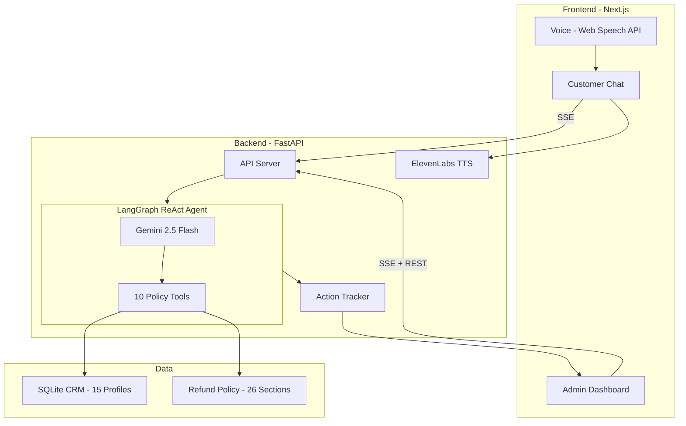

# AI Customer Support Agent

A full-stack AI-powered customer support agent for e-commerce refunds. Built with LangGraph + Google Gemini, FastAPI, and Next.js.

The agent enforces a strict 26-section refund policy, validates every request against multiple rules, runs fraud detection, and provides real-time reasoning logs through an admin dashboard.

## Architecture



## Features

- **AI Agent (Zara)**: LangGraph ReAct loop with Gemini 2.5 Flash, 10 specialized tools
- **Strict Policy Enforcement**: 26-section refund policy with 7-day window, fraud detection, counterfeit claims
- **Return-First Flow**: Eligible refunds schedule a return; refund processed only after item passes inspection (Sections 8, 9, 22)
- **Mock CRM Database**: 15 customer profiles covering all edge cases (eligible, denied, fraud, digital, clearance, in-transit)
- **Real-Time Chat**: SSE-based customer chat with typing indicators and file attachments (photos/videos)
- **Admin Dashboard**: Two views — Reasoning Logs (every tool call, decision, policy citation) and Agent Actions (concrete actions: returns scheduled, refunds approved/denied, escalations, cancellations)
- **Fraud Detection**: Account flagging, risk scoring, return-fraud history analysis
- **Escalate to Human**: One-click escalation button; agent logs the escalation and confirms via customer's email on file
- **Voice Pipeline**: ElevenLabs TTS + Web Speech API STT with graceful fallback to text-only when quota is exhausted
- **Guardrails**: Agent stays in scope — refuses off-topic questions, prompt injection, and identity override attempts

## Quick Start

### Prerequisites

- Python 3.11+
- Node.js 18+
- A Google Gemini API key (free: https://aistudio.google.com/apikey)

### 1. Backend Setup

```bash
cd backend

# Create .env file with your API key
cp .env.example .env
# Edit .env and add your GOOGLE_API_KEY

# Install dependencies
pip install -r requirements.txt

# Start the server (seeds database automatically on first run)
python -m uvicorn app.main:app --reload --port 8000
```

### 2. Frontend Setup

```bash
cd frontend

# Install dependencies
npm install

# Start the dev server
npm run dev
```

### 3. Open the App

- **Customer Chat**: http://localhost:3000
- **Admin Dashboard**: http://localhost:3000/admin
- **API Docs**: http://localhost:8000/docs

## Agent Tools

| Tool | Purpose | Policy Sections |
|------|---------|-----------------|
| `lookup_customer` | Find customer by name/email/phone | - |
| `get_order_details` | Retrieve order info, dates, product flags | - |
| `check_refund_eligibility` | Validate against ALL policy rules | 2-5, 8, 13, 15 |
| `check_fraud_risk` | Fraud/abuse detection and risk scoring | 15, 24 |
| `verify_claim_evidence` | Verify counterfeit/tampering claims | 21, 25 |
| `process_refund` | Initiate return + schedule refund after inspection | 8, 9, 11, 12, 22 |
| `deny_refund` | Log denial with policy citations | All |
| `cancel_order` | Cancel pre-shipment orders | 13 |
| `escalate_to_human` | Escalate complex cases | 7, 19 |
| `get_refund_policy` | Retrieve full policy document | - |

## Demo Scenarios

| Customer | Order | Scenario | Expected Result |
|----------|-------|----------|-----------------|
| Alice Johnson | ORD-1001 | Defective headphones, within 7 days | Return scheduled, refund after inspection |
| Frank Liu | ORD-1006 | Outside 7-day window | DENIED (Section 5) |
| Henry Patel | ORD-1008 | Digital software license | DENIED (Section 4) |
| Leo Mendez | ORD-1012 | Flagged fraud account | BLOCKED (Sections 15, 24) |
| Nathan Brooks | ORD-1014 | Pre-shipment cancel | Cancelled + full refund |
| David Okafor | ORD-1004 | Lost in shipment | Approved directly, no return needed |

## Tech Stack

- **LLM**: Google Gemini 2.5 Flash (free tier)
- **Agent Framework**: LangGraph + LangChain
- **Backend**: Python / FastAPI / SQLAlchemy / SQLite
- **Frontend**: Next.js 16 / Tailwind CSS / TypeScript
- **Communication**: SSE (real-time chat + admin logs + agent actions)
- **Voice**: ElevenLabs TTS (backend proxy) + Web Speech API STT (browser)
